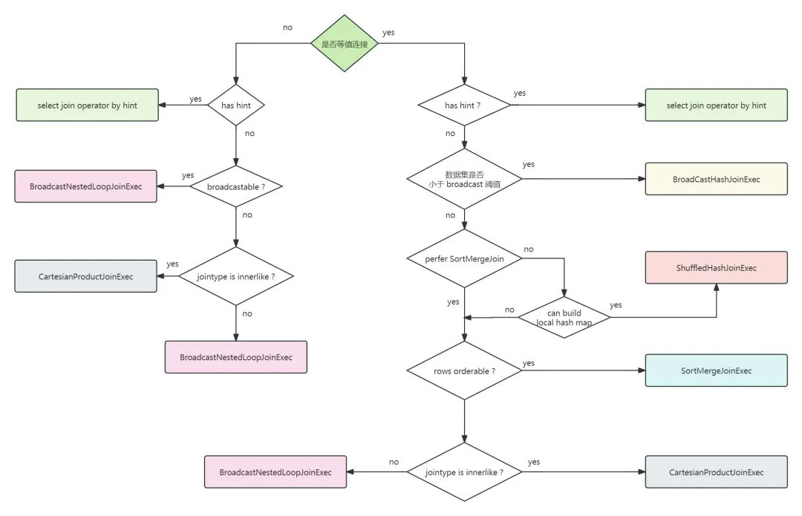

### Spark SQL Join Hints

https://spark.apache.org/docs/3.2.0/sql-performance-tuning.html#join-strategy-hints-for-sql-queries

- 源码 org.apache.spark.sql.catalyst.plans.logical.JoinStrategyHint

- BROADCAST（广播连接）：在大表关联小表时，将小表整张表广播至任务所在的所有机器上，使大表的数据不用在集群间移动，减小 shuffle 带来的计算成本。广播连接只适合其中一张表是小表的情况。
- SHUFFLE_MERGE（SortMerge 连接）：从 Spark 2.3 开始，作为默认的关联方式。比 Shuffle Hash Join 多了一步排序。在大表 join 大表时，Sort merge join 的性能要高于 Shuffle Hash Join。
- SHUFFLE_HASH（Shuffle Hash Join）：根据关联 key 对数据进行分区，然后再进行 join。SHUFFLE_HASH 会对左右两张表使用相同的分区方式，确保相同分区内数据的 key 都是相同的。它遵循经典的 map-reduce 模式：对两张表进行 map 操作。使用关联的 key 作为 map 程序输出的 key。对输出的 key 进行分区，这样一来就可以确保相同 key 的两张表的数据会在一台机器上。在 reducer 端对两张表进行 join 操作。SHUFFLE_HASH 适用于以下两种情况：两张表中用于关联的 key 的数据必须均匀，不能有热点 key。两张表中用于关联的 key 的个数必须大于并行度。（如设置并行度为200，但只有20个key，那么有180个 task 都在空跑）

### Spark Coalesce Hints

https://spark.apache.org/docs/3.2.0/sql-performance-tuning.html#coalesce-hints-for-sql-queries

- COALESCE
- REPARTITION
- REBALANCE 